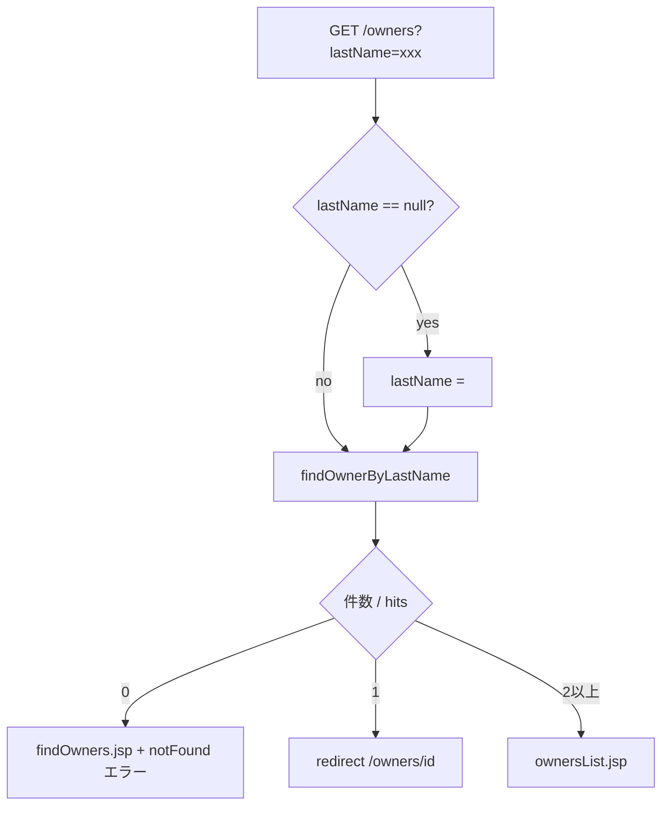
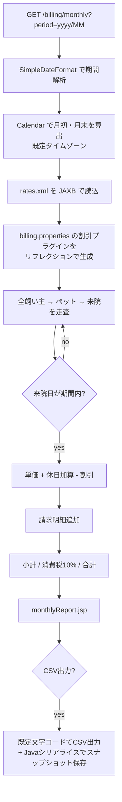
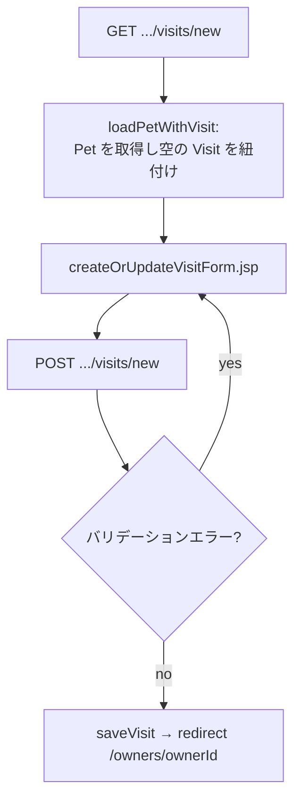

# 現行機能一覧 / Current function list

コードを唯一の根拠として復元。行番号は本ドキュメント作成時点のもの。/
Recovered from the code as the only source of truth; line numbers are as of this document.

| # | 機能 / Function | 入口 / Entry point | 実装 / Implementation |
| --- | --- | --- | --- |
| F-01 | ホーム表示 / Home | `GET /` | `mvc-core-config.xml:44`（`view-controller` → `welcome.jsp`） |
| F-02 | 飼い主検索フォーム / Owner search form | `GET /owners/find` | `OwnerController#initFindForm` |
| F-03 | 飼い主検索実行 / Owner search | `GET /owners` | `OwnerController#processFindForm` |
| F-04 | 飼い主一覧 / Owner list | 同上（複数件時）/ same, when several hits | `owners/ownersList.jsp` |
| F-05 | 飼い主詳細 / Owner detail | `GET /owners/{ownerId}` | `OwnerController#showOwner` |
| F-06 | 飼い主登録 / Create owner | `GET,POST /owners/new` | `OwnerController#initCreationForm`, `#processCreationForm` |
| F-07 | 飼い主編集 / Edit owner | `GET,POST /owners/{ownerId}/edit` | `OwnerController#initUpdateOwnerForm`, `#processUpdateOwnerForm` |
| F-08 | ペット登録 / Create pet | `GET,POST /owners/{ownerId}/pets/new` | `PetController#initCreationForm`, `#processCreationForm` |
| F-09 | ペット編集 / Edit pet | `GET,POST /owners/{ownerId}/pets/{petId}/edit` | `PetController#initUpdateForm`, `#processUpdateForm` |
| F-10 | 来院登録 / Add visit | `GET,POST /owners/{ownerId}/pets/{petId}/visits/new` | `VisitController#initNewVisitForm`, `#processNewVisitForm` |
| F-11 | 来院一覧 / Visit list | `GET /owners/*/pets/{petId}/visits` | `VisitController#showVisits` — **ビュー `visitList` が存在せず実行時エラー / the `visitList` view does not exist, so this fails at runtime** |
| F-12 | 獣医一覧（HTML）/ Vet list (HTML) | `GET /vets.html` | `VetController#showVetList` |
| F-13 | 獣医一覧（JSON/XML）/ Vet list (JSON/XML) | `GET /vets.json`, `GET /vets.xml` | `VetController#showResourcesVetList` |
| F-14 | 例外画面確認 / Error page check | `GET /oups` | `CrashController#triggerException` |
| F-15 | 月次締め表示 / Monthly closing | `GET /billing/monthly` | `BillingController#showMonthlyClosing` |
| F-16 | 月次締めCSV出力 / Closing CSV export | `POST /billing/monthly/export` | `BillingController#exportMonthlyClosing` |
| F-17 | 旧経理システム来院取込 / Legacy visit import | 画面なし（バッチ用クラス）/ no screen, batch class | `LegacyVisitImporter#read` |
| F-18 | リポジトリ呼出監視 / Repository call monitoring | JMX `petclinic:type=CallMonitor` | `CallMonitoringAspect` |

## 主要フロー / Key flows

### 飼い主検索 / Owner search

### 月次締め / Monthly closing

### 来院登録 / Add visit

