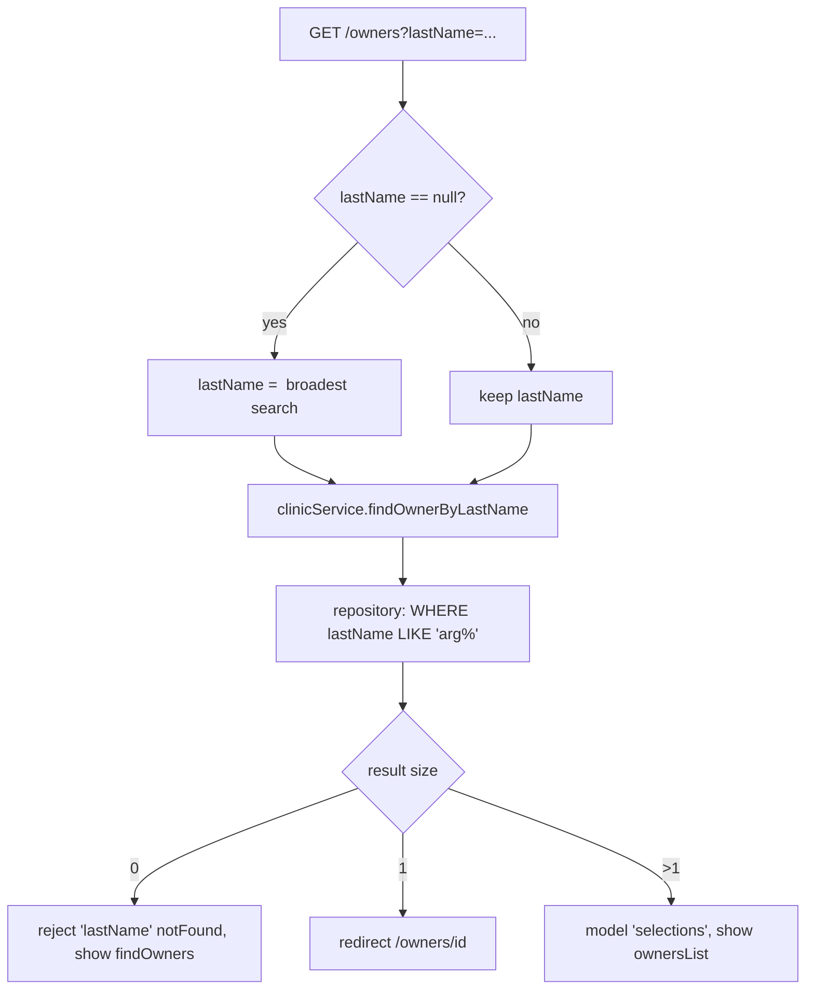
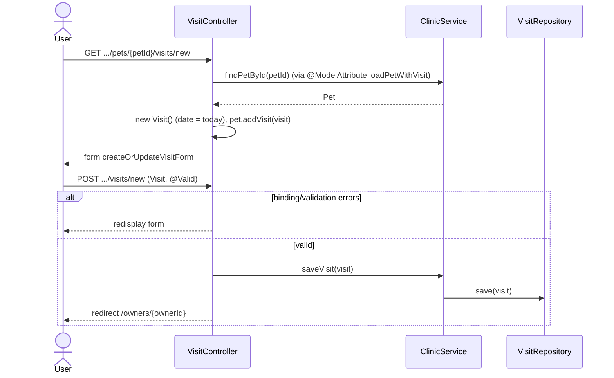
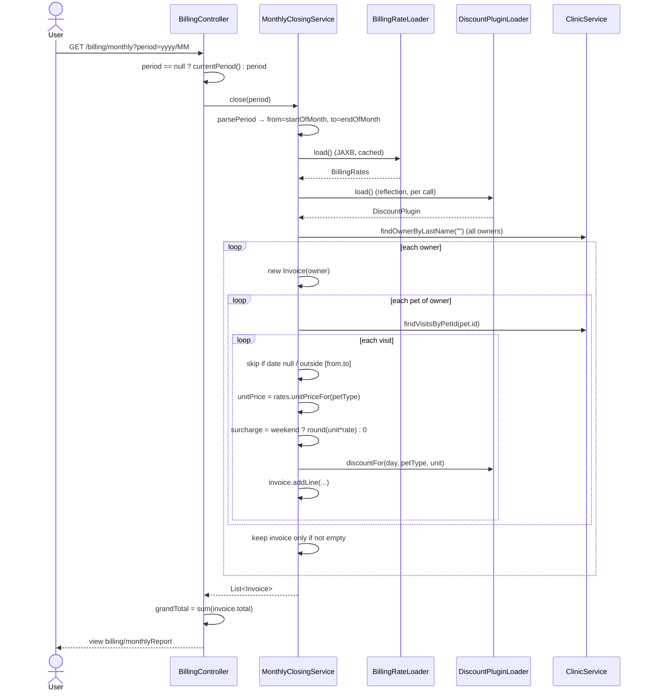
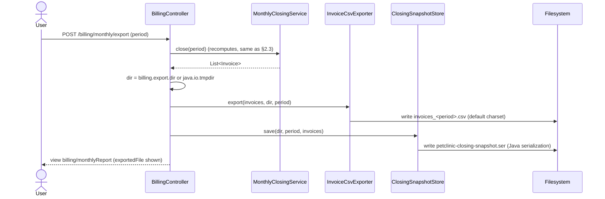
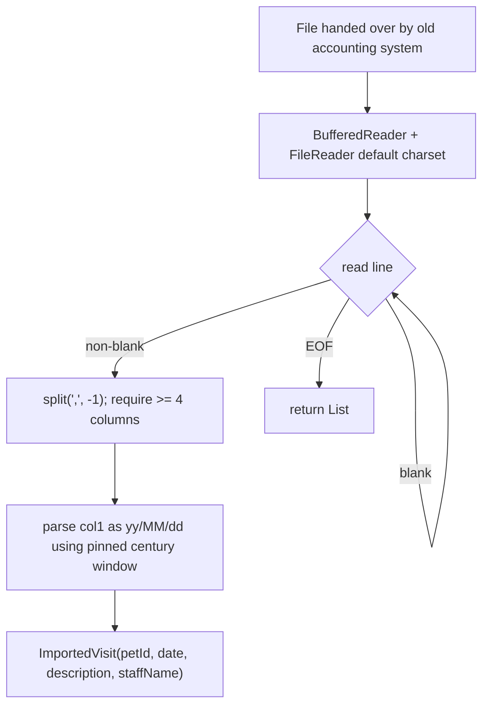
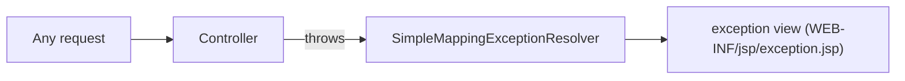

# 2. Process flows — main use cases

Diagrams are derived directly from the cited code. Behavior is **[Confirmed]**
unless annotated otherwise.

## 2.1 Owner search (S2 → S3 → S4)

`OwnerController.processFindForm` (`web/OwnerController.java:82-105`).



Note: an empty `lastName` becomes `LIKE '%'`, i.e. **all owners**
(`OwnerController.java:86-88`, `JpaOwnerRepositoryImpl.java:56-57`). The same
"empty means everything" behavior is what the monthly closing relies on
(§2.3).

## 2.2 Add a visit (S13 → S14)

`VisitController` (`web/VisitController.java:67-90`).



`Visit` defaults its date to `LocalDate.now()` in the constructor
(`model/Visit.java:62-64`); description is `@NotEmpty`
(`model/Visit.java:47-49`). The JDBC repository **cannot update** an existing
visit — only insert (`JdbcVisitRepositoryImpl.java:62-69`).

## 2.3 Monthly closing — recalculate (S17)

`BillingController.showMonthlyClosing` → `MonthlyClosingService.close`.



Source: `web/BillingController.java:42-51,66-76`;
`service/billing/MonthlyClosingService.java:42-90`.

### Per-visit charge calculation (flowchart)

```mermaid
flowchart TD
    V[Visit in period] --> N{date == null?}
    N -- yes --> SKIP[skip visit]
    N -- no --> R{date in [from, to]?}
    R -- no --> SKIP
    R -- yes --> U["unitPrice = rates.unitPriceFor(petType)"]
    U --> W{Sat or Sun?}
    W -- yes --> SUR["surcharge = round(unit * holidaySurchargeRate)"]
    W -- no --> SUR0[surcharge = 0]
    SUR --> DISC
    SUR0 --> DISC["discount = plugin.discountFor(day, petType, unit)"]
    DISC --> LINE["line amount = unit + surcharge - discount"]
```

Source: `MonthlyClosingService.java:64-90`,
`WeekdayDiscountPlugin.java:17-29`, `InvoiceLine.java:66-68`. See
`03-business-rules.md` for the exact numbers.

## 2.4 Monthly closing — export CSV + snapshot (S18)

`BillingController.exportMonthlyClosing` (`web/BillingController.java:53-64`).



The export **re-runs the whole closing calculation** rather than reusing the
already-computed invoices from the GET screen
(`BillingController.java:55`). The snapshot filename is fixed
(`petclinic-closing-snapshot.ser`) and contains no period, so each export
overwrites the previous one (`ClosingSnapshotStore.java:26,28-33`).

## 2.5 Legacy visit import (component B1 — not wired)

`LegacyVisitImporter.read` (`service/billing/LegacyVisitImporter.java:30-65`).
Shown for completeness; **no caller exists** (see `06-open-questions.md`).



Two-digit years are resolved with a century window whose start year comes from
`billing.two.digit.year.start` (default 1980), pinned by writing
`SimpleDateFormat.defaultCenturyStart` via reflection
(`LegacyDateFormats.java:43-57`, `LegacyVisitImporter.java:67-86`).

## 2.6 Exception handling flow



Source: `spring/mvc-core-config.xml:60-66`, demonstrated by
`web/CrashController.java:33-37`.
