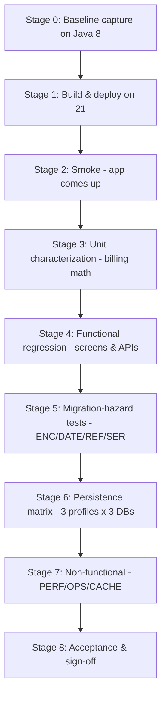

# 5. Test execution order & pass/fail criteria

## 5.1 Execution order (gated stages)

Run in this order; each stage has an **entry gate** (must be satisfied to
start) and an **exit gate** (must pass to proceed). Stop-the-line on any P1
failure.

| Stage | Contents | Entry gate | Exit gate |
| --- | --- | --- | --- |
| 0 | Capture golden masters on Java 8 (`04-...`) | Java 8 app builds & runs (`README.md:16-18`) | Golden masters stored & reproducible; billing unit tests green on Java 8 |
| 1 | P-BUILD-1..3 | Stage 0 done; deps chosen (`02-§2.10`) | WAR builds on JDK 21 for all 3 profiles; no unresolved `javax.*` |
| 2 | P-SMOKE-1..2 | Stage 1 exit | `/` renders on Tomcat 10.1+; startup JVM args documented |
| 3 | P-BILL-1..7 (unit) | Stage 2 exit | All billing numbers == Java 8 golden (P1) |
| 4 | P-UI-1..6, P-API-1..2, P-JAK-1..4 | Stage 3 exit | All screens/APIs == golden; `/vets.xml` no 500 |
| 5 | P-ENC, P-DATE, P-REF, P-SER | Stage 4 exit; OQ-11/OQ-12 decided | Charset/TZ/reflection/serialization behave as decided baseline |
| 6 | P-DATA-1, per profile × DB | Stage 5 exit; MySQL/PostgreSQL available | Parity across profiles; JDBC visit-update behavior matches as-is (OQ-14) |
| 7 | P-PERF-1, P-OPS-1, P-CACHE-1 | Stage 6 exit | Perf within threshold; JMX & cache functional |
| 8 | Full-suite re-run + sign-off | Stages 1–7 pass | All P1/P2 pass; residuals accepted |

**Rationale for order:** cheapest/most-fundamental first (build → smoke →
pure-logic units → functional → hazards → cross-DB → non-functional), so a
break is caught before expensive stages. Billing units run before functional
screens because they are the fastest, highest-value correctness anchor.

## 5.2 Pass/fail criteria per test type

- **Golden-master (HTML/JSON/XML)** — PASS if the Java 21 output equals the
  Java 8 golden after documented normalizations only. Any un-normalized diff =
  FAIL.
- **CSV bytes (P-ENC-1)** — PASS if the produced file's bytes equal the
  **decided** required-charset golden (OQ-11). A change from the Java 8 bytes is
  a FAIL **unless** it is the explicitly approved UTF-8 target.
- **Billing numbers (P-BILL)** — PASS only on exact equality (integers/JPY).
  Any rounding or value difference = FAIL (financial).
- **Reflection (P-REF-1)** — PASS if no `InaccessibleObjectException` escapes to
  the caller and the resulting two-digit-year window equals golden. A silent
  warning-and-fallback is acceptable only if the resulting behavior matches.
- **Serialization (P-SER-1)** — PASS if round-trip succeeds, OR the break is the
  documented/approved outcome of OQ-3.
- **Performance (P-PERF-1)** — PASS if latency and GC pause are within the
  agreed threshold (**[Recommendation]** ≤ +20% p95 latency, no increase in
  error rate) at equal heap; otherwise investigate (informational, not a hard
  release blocker unless egregious).
- **Persistence matrix (P-DATA-1)** — PASS if each profile reproduces the as-is
  behavior for its cell, including documented differences (e.g. JDBC visit
  update throws, OQ-14).

## 5.3 Severity & release gate

| Severity | Definition | Gate |
| --- | --- | --- |
| **Critical** | Any P1 FAIL: billing wrong, data loss, app won't build/deploy, encoding corrupts accounting file | **Blocks release** |
| **Major** | P2 FAIL: a screen/API/validation behaves differently without approval | Blocks release unless explicitly waived by owner |
| **Minor** | P3 FAIL or informational deviation (perf within tolerance band edge, cosmetic) | Track; may ship with a note |

**Release gate (exit of Stage 8):**
1. 100% of P1 tests PASS.
2. 100% of P2 tests PASS or have a signed waiver referencing the specific open
   question / decision.
3. Every deviation from the Java 8 golden is either FAIL-fixed or recorded as an
   approved, intentional change with an owner and rationale.
4. All open questions in `docs/as-is/06-open-questions.md` that affect tested
   behavior (esp. OQ-11 charset, OQ-12 TZ/locale, OQ-3 snapshot, OQ-1
   closing-day) have a **decision on record** — the migration must not silently
   resolve them.

## 5.4 Entry criteria to begin the whole effort

- As-is spec available and reviewed (`docs/as-is/`).
- Java 8 baseline builds and runs (`README.md:16-18`).
- Target versions selected (`02-...§2.10`) and a Jakarta test container
  available.
- Deterministic fixtures prepared (`04-...§4.3`).

## 5.5 Exit criteria for the migration

- Release gate (§5.3) satisfied on Java 21 across the default profile at
  minimum, and across MySQL/PostgreSQL if they are production targets (OQ-13).
- Golden-master suite committed and green on both Java 8 and Java 21, so it
  becomes the permanent regression net the project previously lacked.
- Any required runtime configuration (charset, `user.timezone`, `--add-opens`,
  GC flags) captured in deployment docs.

## 5.6 Deliverables / artifacts

- Golden-master corpus + characterization test suite (new `src/test`).
- Per-stage test report (pass/fail, diffs) and a dependency-compatibility report.
- Perf comparison (Java 8 vs 21).
- Decision log resolving the behavior-affecting open questions.
